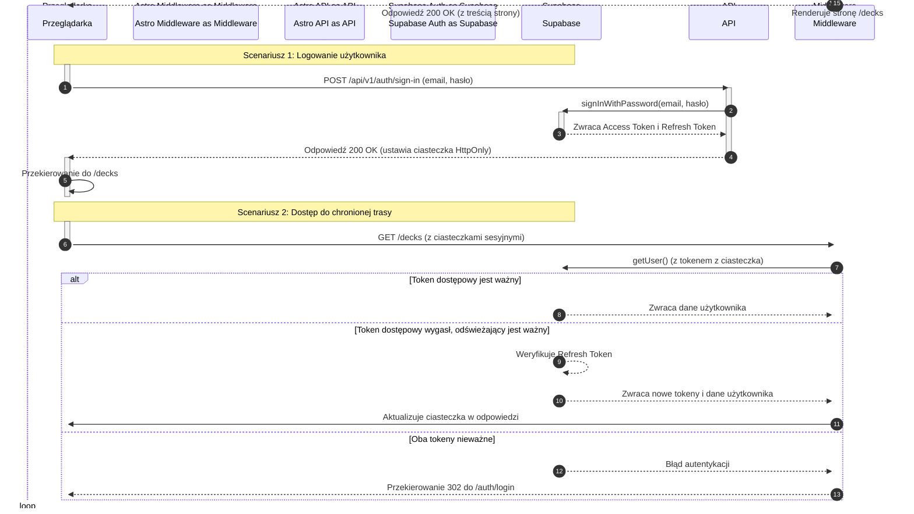

```mermaid
sequenceDiagram
    autonumber

    participant Przeglądarka
    participant Astro Middleware as Middleware
    participant Astro API as API
    participant Supabase Auth as Supabase

    Note over Przeglądarka, Supabase: Scenariusz 1: Logowanie użytkownika

    activate Przeglądarka
    Przeglądarka->>API: POST /api/v1/auth/sign-in (email, hasło)
    deactivate Przeglądarka
    
    activate API
    API->>Supabase: signInWithPassword(email, hasło)
    activate Supabase
    Supabase-->>API: Zwraca Access Token i Refresh Token
    deactivate Supabase
    
    API-->>Przeglądarka: Odpowiedź 200 OK (ustawia ciasteczka HttpOnly)
    deactivate API

    activate Przeglądarka
    Przeglądarka->>Przeglądarka: Przekierowanie do /decks
    deactivate Przeglądarka

    Note over Przeglądarka, Supabase: Scenariusz 2: Dostęp do chronionej trasy

    activate Przeglądarka
    Przeglądarka->>Middleware: GET /decks (z ciasteczkami sesyjnymi)
    deactivate Przeglądarka

    activate Middleware
    Middleware->>Supabase: getUser() (z tokenem z ciasteczka)
    
    activate Supabase
    alt Token dostępowy jest ważny
        Supabase-->>Middleware: Zwraca dane użytkownika
    else Token dostępowy wygasł, odświeżający jest ważny
        Supabase-->>Supabase: Weryfikuje Refresh Token
        Supabase-->>Middleware: Zwraca nowe tokeny i dane użytkownika
        Middleware->>Przeglądarka: Aktualizuje ciasteczka w odpowiedzi
    else Oba tokeny nieważne
        Supabase-->>Middleware: Błąd autentykacji
        Middleware-->>Przeglądarka: Przekierowanie 302 do /auth/login
        loop
        end
    end
    deactivate Supabase
    
    Middleware->>Middleware: Renderuje stronę /decks
    Middleware-->>Przeglądarka: Odpowiedź 200 OK (z treścią strony)
    deactivate Middleware

```
