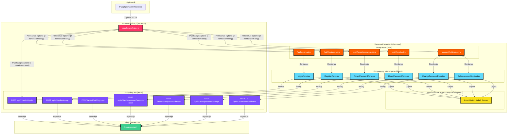

```mermaid
flowchart TD
    classDef astro fill:#FF5E00,stroke:#000,stroke-width:2px,color:#fff;
    classDef react fill:#61DAFB,stroke:#000,stroke-width:2px,color:#000;
    classDef api fill:#7C4DFF,stroke:#000,stroke-width:2px,color:#fff;
    classDef shared fill:#F7DF1E,stroke:#000,stroke-width:2px,color:#000;
    classDef supabase fill:#3ECF8E,stroke:#000,stroke-width:2px,color:#fff;
    classDef middleware fill:#FF3366,stroke:#000,stroke-width:2px,color:#fff;

    subgraph "Użytkownik"
        U[Przeglądarka Użytkownika]
    end

    subgraph "Warstwa Prezentacji (Frontend)"
        subgraph "Strony Astro (SSR)"
            P_LOGIN["/auth/login.astro"]:::astro
            P_REGISTER["/auth/register.astro"]:::astro
            P_FORGOT["/auth/forgot-password.astro"]:::astro
            P_RESET["/auth/reset.astro"]:::astro
            P_SETTINGS["/account/settings.astro"]:::astro
        end

        subgraph "Komponenty Interaktywne (React)"
            C_LOGIN[LoginForm.tsx]:::react
            C_REGISTER[RegisterForm.tsx]:::react
            C_FORGOT[ForgotPasswordForm.tsx]:::react
            C_RESET[ResetPasswordForm.tsx]:::react
            C_CHANGE[ChangePasswordForm.tsx]:::react
            C_DELETE[DeleteAccountSection.tsx]:::react
        end

        subgraph "Współdzielone Komponenty UI (shadcn/ui)"
            SHARED_UI["Input, Button, Label, Sonner"]:::shared
        end
    end

    subgraph "Warstwa Aplikacji (Backend)"
        MW["middleware/index.ts"]:::middleware
        
        subgraph "Endpointy API (Astro)"
            API_SIGN_IN["POST /api/v1/auth/sign-in"]:::api
            API_SIGN_UP["POST /api/v1/auth/sign-up"]:::api
            API_SIGN_OUT["POST /api/v1/auth/sign-out"]:::api
            API_REQ_RESET["POST /api/v1/auth/password/request-reset"]:::api
            API_RESET["POST /api/v1/auth/password/reset"]:::api
            API_CHANGE["POST /api/v1/auth/password/change"]:::api
            API_DELETE["DELETE /api/v1/auth/account/delete"]:::api
        end
    end

    subgraph "Usługi Zewnętrzne"
        DB_AUTH[Supabase Auth]:::supabase
    end

    %% Relacje Użytkownik -> Strony
    U -- "Żądanie HTTP" --> MW

    %% Relacje Middleware -> Strony / API
    MW -- "Przekazuje żądanie (z kontekstem sesji)" --> P_LOGIN
    MW -- "Przekazuje żądanie (z kontekstem sesji)" --> P_REGISTER
    MW -- "Przekazuje żądanie (z kontekstem sesji)" --> P_FORGOT
    MW -- "Przekazuje żądanie (z kontekstem sesji)" --> P_RESET
    MW -- "Przekazuje żądanie (z kontekstem sesji)" --> P_SETTINGS
    MW -- "Przekazuje żądanie (z kontekstem sesji)" --> API_SIGN_IN

    %% Relacje Strony Astro -> Komponenty React
    P_LOGIN -- "Renderuje" --> C_LOGIN
    P_REGISTER -- "Renderuje" --> C_REGISTER
    P_FORGOT -- "Renderuje" --> C_FORGOT
    P_RESET -- "Renderuje" --> C_RESET
    P_SETTINGS -- "Renderuje" --> C_CHANGE
    P_SETTINGS -- "Renderuje" --> C_DELETE

    %% Relacje Komponenty React -> Współdzielone UI
    C_LOGIN & C_REGISTER & C_FORGOT & C_RESET & C_CHANGE & C_DELETE -- "Używa" --> SHARED_UI

    %% Relacje Komponenty React -> API
    C_LOGIN -- "fetch()" --> API_SIGN_IN
    C_REGISTER -- "fetch()" --> API_SIGN_UP
    C_FORGOT -- "fetch()" --> API_REQ_RESET
    C_RESET -- "fetch()" --> API_RESET
    C_CHANGE -- "fetch()" --> API_CHANGE
    C_DELETE -- "fetch()" --> API_DELETE
    %% (SignOut może być linkiem lub przyciskiem w głównym layoucie)

    %% Relacje API -> Supabase
    API_SIGN_IN & API_SIGN_UP & API_SIGN_OUT & API_REQ_RESET & API_RESET & API_CHANGE & API_DELETE -- "Wywołuje" --> DB_AUTH
```
